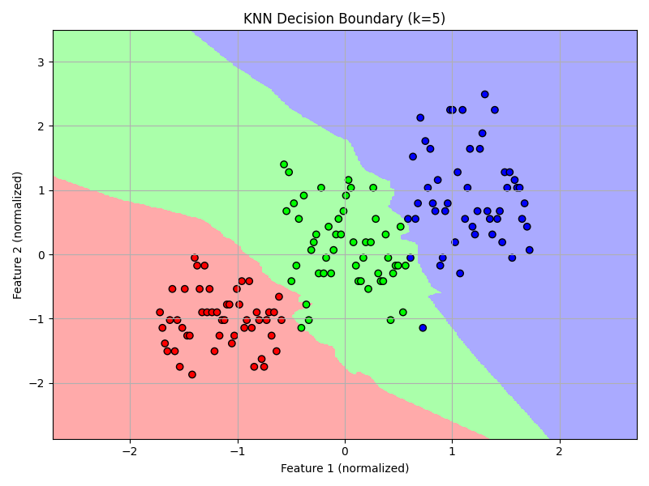

# Task-6-K-Nearest-Neighbors-KNN-Classification
 Iris Dataset

##  Objective
To understand and implement the K-Nearest Neighbors (KNN) algorithm for classification problems using the Iris dataset.

---

##  Tools & Libraries
- Python
- Pandas
- NumPy
- Scikit-learn
- Matplotlib

---

##  Dataset
- **Dataset Used:** iris.csv
- **Features Used:** First 2 columns (for 2D visualization)
- **Target:** Last column (species)

---

##  Steps Performed

### 1. Load & Prepare Data
- Loaded the dataset using `pandas.read_csv()`.
- Selected the first 2 features to visualize decision boundaries.
- Encoded the target classes (if they were strings).
- Normalized features using `StandardScaler`.

### 2. Train-Test Split
- Split the dataset into training (70%) and testing (30%) sets.

### 3. Train the Model
- Used `KNeighborsClassifier` from `sklearn.neighbors`.
- Trained and tested with multiple values of K: **1, 3, 5, 7**.

### 4. Evaluate the Model
- Printed accuracy and confusion matrix for each K.
- Selected **K = 5** to visualize decision boundaries.

### 5. Visualize Decision Boundary
- Used a meshgrid to plot KNN prediction regions.
- Visualized using `matplotlib` with color-coded classes.

---

## 📈 Output

🔍 K=1
Accuracy: 1.0
Confusion Matrix:
 [[19  0  0]
 [ 0 13  0]
 [ 0  0 13]]

🔍 K=3
Accuracy: 1.0
Confusion Matrix:
 [[19  0  0]
 [ 0 13  0]
 [ 0  0 13]]

🔍 K=5
Accuracy: 1.0
Confusion Matrix:
 [[19  0  0]
 [ 0 13  0]
 [ 0  0 13]]

🔍 K=7
Accuracy: 1.0
Confusion Matrix:
 [[19  0  0]
 [ 0 13  0]
 [ 0  0 13]]

## 🖼 Visualization

The decision boundary plot is saved as:

**📁 `decision_boundary.png`**

